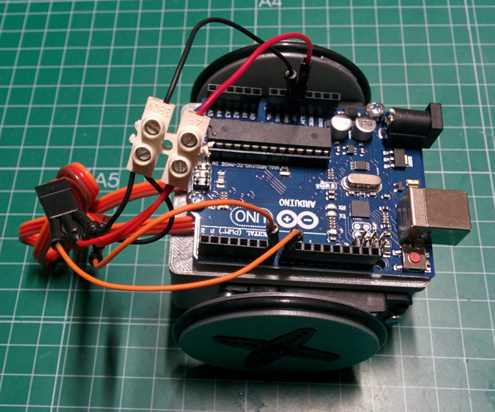

# Robots para la exposición del Parque de las Ciencias

## [Modelo MiniSkyBot 2](http://www.iearobotics.com/wiki/index.php?title=Miniskybot_2)

## [Montaje](https://goo.gl/photos/wFN3VKyei4efHCva8)

## [Ejemplos](./Ejemplos)

* [Test servos](Ejemplos/test0_servo/test0_servo.ino )

* [Calibración de servos](Ejemplos/Calibrar_servos/Calibrar_servos.ino)

* [Test siguelíneas](Ejemplos/testSiguelineas/testSiguelineas.ino)

* [Siguelíneas](Ejemplos/Siguelineas/Siguelineas.ino)

* [Sígueme](Ejemplos/Sigueme/Sigueme.ino)
